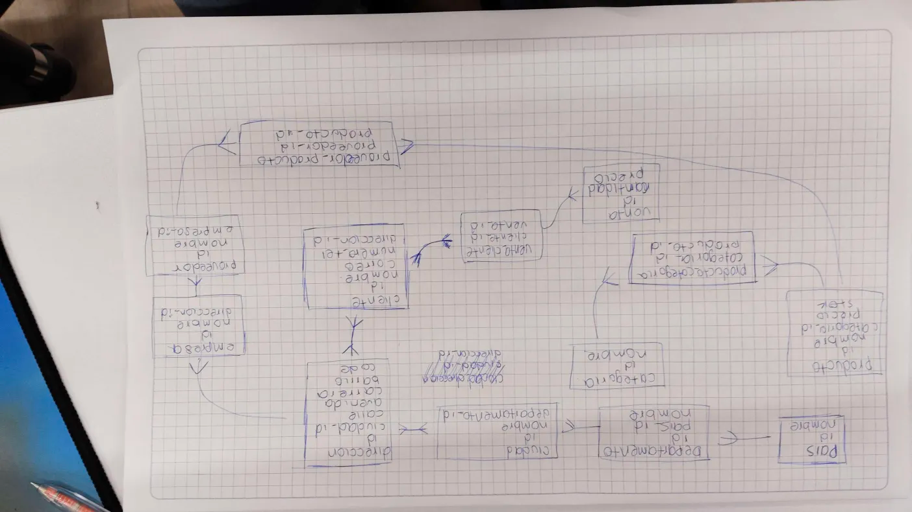

# examen_PostgreSQL


TechZone es una base de datos diseñada para gestionar la informacion de una tienda de tecnologia. El sistema permite almacenar datos sobre, proveedores, clientes, ventas, direcciones y mas. Su proposito es facilitar consultas utiles ¡.

MODELO ENTIDAD RELACION



El diagrama describe cada relacion.

# Instruciones

Primero creamos la base de3 datos con 
```sql
  CREATE DATABASE techzone
```
 y la usamos con 
 ```sql
    \c techzone
 ```

Creamos la base de datos que estan en la carpeta sql\db.sql 
e importamos de insert.sql

vemos las consultas y procedimientos en la carpeta consultas